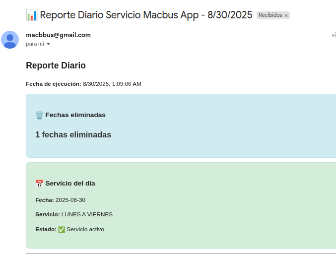

# 🧹 Neo4j Daily Cleanup Automation

Automated daily cleanup for outdated calendar dates in Neo4j, with email reporting for success or failure.

## 🚀 Features
* 🔄 Daily cleanup of outdated calendar entries in Neo4j
* 📧 Email report with status and service information
* ⚙️ Scheduled using GitHub Actions
* ❗ Failure notifications via email

## 📦 Setup

### 1. Clone this repository.
### 2. Install dependencies:
```bash
npm install
```
### 3. Copy the example environment file:
```bash
cp .env.example .env
```
### 4. Fill in the required environment variables in .env.

## 🔐 Required GitHub Secrets
Make sure to set the following secrets in your GitHub repository:

- `NEO4J_URI`
- `NEO4J_USER`
- `NEO4J_PASSWORD`
- `SMTP_HOST`
- `SMTP_PORT`
- `SMTP_SECURE`
- `SMTP_USER`
- `SMTP_PASSWORD`
- `EMAIL_FROM`
- `EMAIL_TO`

## 🕐 Scheduling
This workflow runs automatically every day at 03:00 UTC, which corresponds to 00:00 in Argentina (UTC-3).
```bash
on:
  schedule:
    - cron: '0 3 * * *'  # Every day at 03:00 UTC (midnight in Argentina)
```

## 📧 Email Report
An HTML email is sent after each run, summarizing:
* 🗑️ Number of calendar dates deleted (from the previous day)
* 📅 Current date in the database
* 🏢 Service scheduled for today
* ✅ or ⚠️ Status of service availability

<p align="center"> <strong>Email Report Example</strong><br> <br><br> </p>